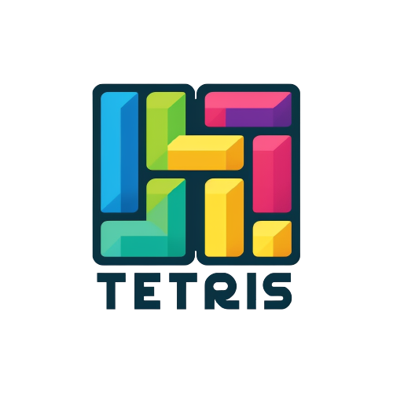

# Tetris Game

<p align="center">

</p>

## Description
This project is a Tetris game implemented in Java. It was developed as a group project for a school assignment. The project was divided into two parts: object modeling and programming. Initially, a team of two members worked on the object modeling, and later, a team of four members worked on the programming phase.

The objective of the Tetris game is to manipulate falling blocks called Tetriminos to create horizontal lines without any gaps. When a line is completed, it disappears, and the player earns points. The game ends when the Tetriminos stack up to the top of the playing field.

The project utilizes Java's object-oriented programming principles and graphical user interface components to provide an interactive and enjoyable gaming experience. 

## It includes features such as:

Random generation of Tetriminos
Falling and moving Tetriminos
Rotating Tetriminos
Clearing completed lines
Scoring system
Game over condition

## Installation
Ensure that you have Java Development Kit (JDK) installed on your system. If not, download and install the latest JDK from the official Oracle website.

## Clone the repository:

```git clone https://github.com/LaCobble/tetris.git```

Navigate to the project directory:

```cd tetris```

Compile the Java source files:

```javac *.java```

## Usage

Use the following controls to play the game :

Left Arrow: Move the Tetrimino left

Right Arrow: Move the Tetrimino right

Down Arrow: Accelerate the Tetrimino's descent

Up Arrow: Rotate the Tetrimino clockwise

P: Pause the game
